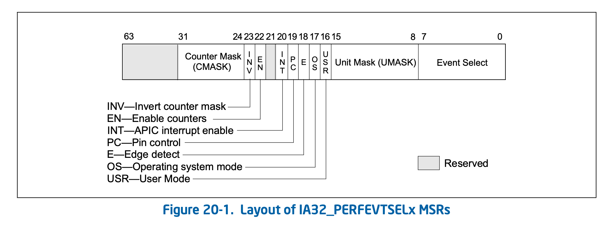

# PERFORMANCE MONITORING

**一个名词**

PMU (Performance Monitoring Unit)

**两个网址**

- Performance monitoring events

https://perfmon-events.intel.com

- performance monitoring event files

https://download.01.org/perfmon

## 1. 性能监控概述

三种非架构（特定型号，不同处理器之间不兼容）性能监控的处理器：

- Pentium处理器，引入一组特定型号性能计数器MSRs用于性能监控，性能计数器的值可以用来优化系统和编译器的性能。

- Intel P6系列处理器，加强性能检测机制，扩展性能事件。

- Intel NetBurst微架构处理器，引入一种分布式的性能监控机制和性能事件。

Intel Core Solo（独显）和Intel Core Duo（多核）处理器支持一组架构性能事件和一组非架构性能事件。新一代的Intel处理器支持增强的架构性能事件和非架构性能事件。从Intel Core Solo和Intel Core Duo处理器开始，有两类性能监控：

- 架构性能监控
  - 计数或基于中断的事件采样方法
  - 体系结构无关
  - 可用性能事件数量较少，可通过CPUID.0AH查看

- 非架构性能监控
  - 计数或基于中断的事件采样方法
  - 体系结构相关
  - 不同架构可用性能事件不同，不能通过CPUID查看

## 2. 架构性能监控

架构性能事件可以在不同处理器上使用，CPUID.0AH叶为每个增强功能提供版本ID，高版本兼容低版本功能。

| version ID | Support processor                                            | 
| ---------- | ------------------------------------------------------------ |
| 1          | Intel Core Solo、Intel Core Duo                              |
| 2          | Intel Core 2 Duo processor T7700 、newer processors based on Intel Core microarchitecture |
| 3          | 45 nm and 32 nm Intel Atom processors、Intel Atom Intel Atom processors based on the Silvermont microarchitecture、Intel Atom processors based on the Airmont microarchitecture、Intel Core processors and related Intel Xeon processor families based on the Nehalem through Broadwell microarchitectures |
| 4          | Intel Atom processors based on the Goldmont、Goldmont Plus microarchitectures、Intel processors based on the Skylake through Coffee Lake microarchitectures |
| 5          | Intel Atom processors starting with processors based on the Tremont microarchitecture、Intel processors starting with processors based on the Ice Lake microarchitecture | 

### 2.1 架构性能监控version 1

架构性能事件监控使用成对存在的寄存器来完成：

- 性能事件选择寄存器（IA32_PERFEVTSELx MSR）

- 性能监控计数器（IA32_PMCx MSR ）

两者的特点：

- IA32_PERFEVTSELx的位域布局在不同的微架构中是一样的
- IA32_PERFEVTSELx MSR的地址在不同的微体系结构中是一样的
- IA32_PMC MSR的地址在不同的微体系结构中是一样的
- **每个逻辑处理器都有自己的IA32_PERFEVTSELx和IA32_PMCx MSRs集，共享一个处理器核心的逻辑处理器之间不共享性能监控配置和计数器。**

架构性能监控通过cpuid可以查到以下信息：

- 性能监控计数器的数量（IA32_PERFEVTSELx MSR与IA32_PMCx MSR一一对应）

- 每个IA32_PMCx中支持的比特数

- 一个逻辑处理器中支持的架构性能监控事件的数量

可以通过cpuid检查架构性能监控的可用性（CPUID.0AH），查询CPUID.0AH:EAX[bits 7:0]获得版本标识符，如果大于0，表示支持架构性能监控。首先查询CPUID.0AH的版本标识符；然后分析CPUID.0AH.EAX、CPUID.0AH.EBX中返回的值，确定可用的功能。在架构性能监控的初始化中，可以确定每个核心支持多少个IA32_PERFEVTSELx/IA32_PMCx MSR对，PMC的位宽，以及可用的架构性能监控事件的数量。

#### 2.1.1  架构性能监控version 1应用

架构性能监控组件包括一组性能监控计数器和性能监控事件选择寄存器。这些MSRs具有这些特性：

- **IA32_PMCx MSR**从地址**0C1H**开始，占据一个连续的MSR地址空间块。每个逻辑处理器的MSR数量使用CPUID.0AH:EAX[15:8]查询。（IA32_PMCx MSR的数量可能与硬件上存在的物理计数器的数量不同，因为在更高权限级别运行的代理（例如，VMM）可能不会暴露所有的计数器。）

- **IA32_PERFEVTSELx** MSRs从地址**186H**开始，占据一个连续的MSR地址空间块。每个性能事件选择寄存器都与0C1H地址块中的相应性能计数器成对。（IA32_PERFEVTSELx MSR的数量可能与硬件上存在的物理计数器的数量不同，因为在更高权限级别运行的代理（例如VMM）可能不会暴露所有的计数器。）

- IA32_PMCx MSR的位宽是使用CPUID.0AH:EAX[23:16]报告。这是读操作的有效位数。在写操作中，MSR的低阶32位可以用任何数值写入，高阶位由第31位的数值进行符号扩展。

- IA32_PERFEVTSELx MSR的位域布局是架构性能的。

关于IA32_PERFEVTSELx MSRs的位域布局如图：

- 事件选择字段[7:0]，用于选择微架构条件的事件逻辑单元（参见表18-1，关于架构事件及其8位代码的列表）。这个字段的值集是由架构上定义的；每个值都对应于一个用于架构性能事件的事件逻辑单元。架构事件的数量是使用CPUID.0AH:EAX查询的。一个处理器可能只支持预先定义的值的一个子集。

Event select field (bits 0 through 7)：事件选择码区填写需要监测的事件码，这些事件码都是事先定义好的，可以在Intel的手册中查找。

Unit mask (UMASK) field (bits 8 through 15)：掩码区填写与事件选择码对应掩码，掩码与事件码共同使用来确定要监测的事件，掩码与事件码一样是事先定义好的，可在Intel手册上查找。

USR (user mode) flag (bit 16)：标识是否统计CPU处于用户态（CPU处于特权级别为：1、2、3）下发生的事件。可以与下面的OS位配合使用。

OS (operating system mode) flag (bit 17)：标识是否统计CPU处于系统态（CPU处于特权级别为0）下发生的事件。可以与上面的USR位配合使用。

EN (Enable Counters) Flag (bit 22):计数允许位。注意：在写计数器IA32_PMCx之前，必须清除计数允许位（设为0）。

Counter mask (CMASK) field (bits 24 through 31):计算器掩码，如它不为零，但事件发生是，只有它小于计数器的值，计数器计数才会增加1。

1. UnHalted Core Cycles（未停止的核心周期数）：指处理器芯片在工作状态下未停止的时钟周期数，包括执行有效指令和处于等待状态的周期。
2. Instruction Retired（指令退役数）：指处理器退役的指令数，包括因为分支预测错误或异常而回退的指令。
3. UnHalted Reference Cycles（未停止的参考周期数）：指处理器芯片在工作状态下未停止的参考周期数，包括指令、数据和缓存访问周期。
4. LLC Reference（最后一级缓存参考数）：指处理器芯片尝试访问最后一级缓存（LLC）的次数。
5. LLC Misses（最后一级缓存缺失数）：指处理器芯片尝试访问最后一级缓存（LLC）但失败的次数。
6. Branch Instruction Retired（分支指令退役数）：指处理器退役的分支指令数。
7. Branch Misses Retired（分支预测错误退役数）：指处理器因为分支预测错误而回退的分支指令数。
8. Topdown Slots（处理器的可用槽位数）：指处理器同时可以处理的指令数量。

